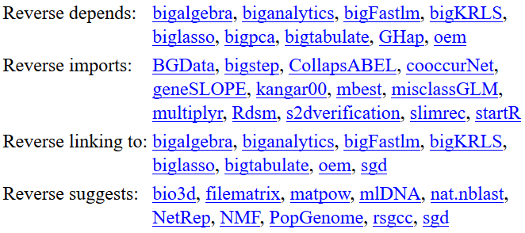
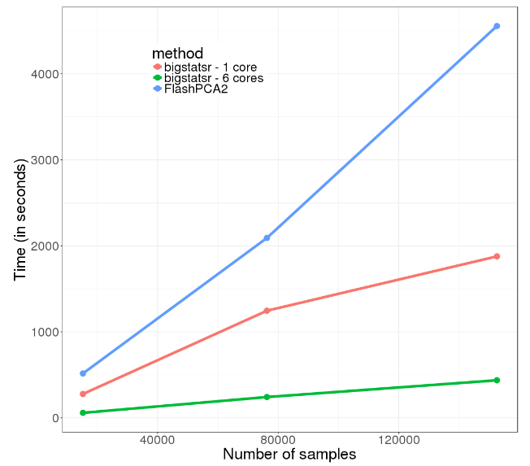

```{r setup, include=FALSE}
options(htmltools.dir.version = FALSE)
knitr::opts_chunk$set(echo = FALSE, fig.align = 'center')
```

## About

I'm a PhD Student (2016-2019) in **Predictive Human Genetics** in Grenoble.

$$\boxed{\Large{\text{Disease} \sim \text{DNA mutations}}}$$

```{r}
knitr::include_graphics("http://www.blacksheep-van.com/wp-content/uploads/2016/03/Blacksheep-location-de-van-ame%CC%81nage-a%CC%80-Grenoble-1.jpg")
```

---

## Very large genotype matrices

- currently: 15K x 300K, [celiac disease](http://www.nature.com/ng/journal/v42/n4/abs/ng.543.html)

- soon: 500K x 800K, [UK Biobank](https://doi.org/10.1371/journal.pmed.1001779)
 
```{r, out.width='65%'}
knitr::include_graphics("https://media.giphy.com/media/3o7bueyxGydy48Lwgo/giphy.gif")
```

---

## Problem I had

```{r, out.width='100%'}
# https://docs.google.com/drawings/d/1Z--fI35S0B3pUSEmUVw1H6KgJMGhtneUX5koqtebdiY/edit
knitr::include_graphics("memory-problem.svg")
```

---

## Solution I found: R package **bigmemory**

```{r}
knitr::include_graphics("http://www.brokenthorn.com/Resources/images/virtual-memory%5B1%5D.png")
```

.footnote[Michael J. Kane, John Emerson, Stephen Weston (2013).]

---

## Dependencies on **bigmemory**

```{r}

```

---

## Sparse linear models: **biglasso**

```{r, out.width='70%'}
knitr::include_graphics("https://raw.githubusercontent.com/YaohuiZeng/biglasso/master/vignettes/2016-11-20_vary_p_pkgs.png")
```

.footnote[Zeng, Y., and Breheny, P. (2017).]

---

## Partial Singular Value Decomposition

```{r, out.width='65%'}

```

.footnote[based on R package **RSpectra**]

---

## Split-(par)Apply-Combine Strategy

A [StackOverflow question](https://stackoverflow.com/q/42111876/6103040): compute the norm of each column.

```{r, echo = TRUE}
x <- bigmemory::big.matrix(200, 10000)
x[] <- rnorm(length(x))

microbenchmark::microbenchmark(
  "1" = biganalytics::apply(x, 2, function(x) {
    sqrt(sum(x^2))
  }),
  "2" = bigstatsr::big_apply(x, a.FUN = function(X, ind) {
    sqrt(colSums(X[, ind]^2))
  }, a.combine = 'c'),
  times = 20
)
```


---

class: inverse, center, middle

# Thanks!

<br/><br/>

Package's website: https://privefl.github.io/bigstatsr/

Twitter and GitHub: [@privefl](https://twitter.com/privefl)

Presentation available online: https://goo.gl/nNg0hw

.footnote[Slides created via the R package [**xaringan**](https://github.com/yihui/xaringan).]
