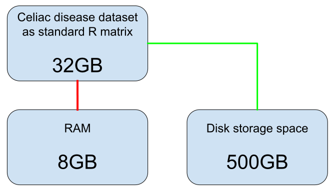
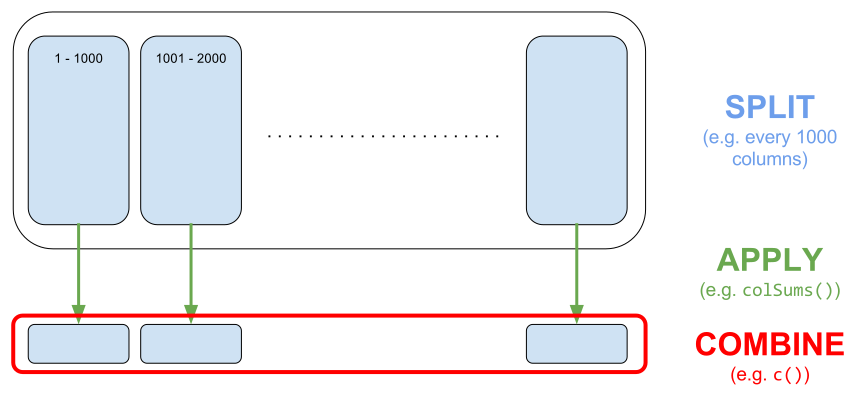

```{r setup, include=FALSE}
options(htmltools.dir.version = FALSE)
knitr::opts_chunk$set(echo = FALSE, fig.align = 'center')
```

## About

I'm a PhD Student (2016-2019) in **Predictive Human Genetics** in Grenoble.

$$\boxed{\Large{\text{Disease} \sim \text{DNA mutations}}}$$

```{r}
knitr::include_graphics("http://www.blacksheep-van.com/wp-content/uploads/2016/03/Blacksheep-location-de-van-ame%CC%81nage-a%CC%80-Grenoble-1.jpg")
```

---

## Very large genotype matrices

- currently: 15K x 300K, [celiac disease](http://www.nature.com/ng/journal/v42/n4/abs/ng.543.html)

- soon: 500K x 800K, [UK Biobank](https://doi.org/10.1371/journal.pmed.1001779)
 
```{r, out.width='65%'}
knitr::include_graphics("https://media.giphy.com/media/3o7bueyxGydy48Lwgo/giphy.gif")
```

---

## Problem I had

```{r, out.width='100%'}

```

---

## Solution I found

```{r, out.width='100%'}

```

.footnote[Michael J. Kane, John Emerson, Stephen Weston (2013).]

---

## Similar accessor as R matrices

</br>

```{r, out.width='80%'}
knitr::include_graphics("http://i.ebayimg.com/images/i/200955927319-0-1/s-l1000.jpg")
```

---

## Split-(par)Apply-Combine Strategy

### Apply standard R functions to big matrices (in parallel): `big_apply`

```{r, out.width='100%'}

```

.footnote[strategy coined by Hadley Wickham (2011)]

---

<!-- ## Matrix operations -->

<!-- - (cross-)products with matrices/vectors -->

<!-- - special tricks for handling scaling ([vignette](https://privefl.github.io/bigstatsr/articles/operations-with-scaling.html) and [blog post](https://goo.gl/L8cNbo)) -->

<!-- <br/> -->

<!-- ### Example: computation of correlation of a 100,000 x 5000 matrix -->

<!-- - `cor`: 22 minutes  -->

<!-- - `big_cor`: 1 minute  -->

<!-- --- -->

## Similar accessor as Rcpp matrices

```{r, out.width='100%'}

```

---

## Partial Singular Value Decomposition

15K x 100K `big.matrix`, 6 cores, K = 10, **1 min** (vs 2h in base R)

</br>

```{r, out.width='60%'}
knitr::include_graphics("https://cdn.meme.am/cache/instances/folder897/500x/75201897/speedy-gonzalez-you-are-lightning-fast.jpg")
```

.footnote[based on R package **RSpectra**]

---

## Sparse linear models: **biglasso**

```{r, out.width='70%'}
knitr::include_graphics("https://raw.githubusercontent.com/YaohuiZeng/biglasso/master/vignettes/2016-11-20_vary_p_pkgs.png")
```

.footnote[Zeng, Y., and Breheny, P. (2017).]

---

## Other functions


- matrix operations (Split-Apply-Combine strategy)

- association of each variable with an output (RcppArmadillo)

- plotting functions (ggplot2)

- read from text files

- others..

---

class: inverse, center, middle

# I'm now able 
# to run algorithms
# on 100GB of data

---

## R Packages

```{r, out.width='100%'}

```


.footnote[Paper in preparation: "Efficient management and analysis of large-scale genome-wide data with two R packages: bigstatsr and bigsnpr".]

---

## Contributors are welcomed!

```{r, out.width='80%'}
knitr::include_graphics("https://applicationsandroidfrance.com/wp-content/uploads/2012/06/cat1200.jpg")
```

---

class: inverse, center, middle

# Thanks!

<br/><br/>

Package's website: https://privefl.github.io/bigstatsr/

Twitter and GitHub: [@privefl](https://twitter.com/privefl)

Presentation available online: https://goo.gl/nNg0hw

.footnote[Slides created via the R package [**xaringan**](https://github.com/yihui/xaringan).]
